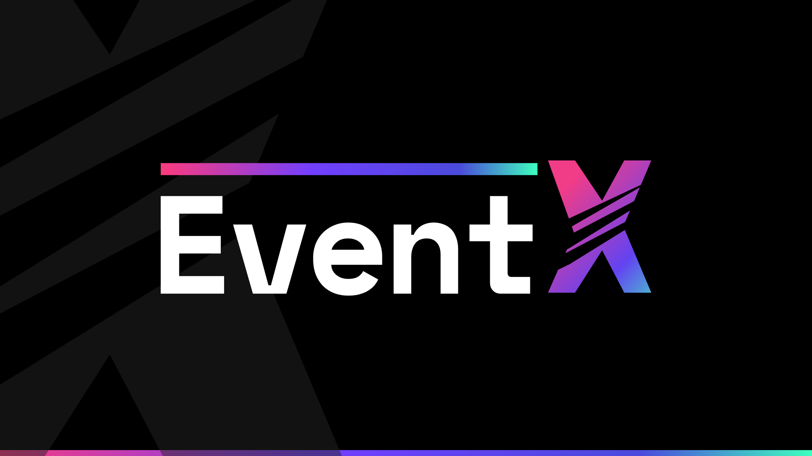
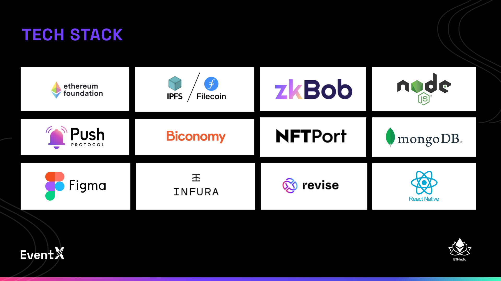

  

# EventX

> Reimagine events via E2E Event Management, offering pre-during-post event soulns. With NFT-based ticket issuance, chain attendance, IRL phygital mgmt system, unique ways of networking and memories!

## 🍿 Features

- Email-based signup makes it simple for people to join a web3 app. - Your keys are fully non-custodial wallets because "Not your keys, not your assets":D
- Simple attendance scanning: To record attendance, organisers only need to scan attendees' QR codes.
- Add Redeemables - Add unlocked material, gratis digital goods, beverages, snacks, etc. and confirm through scanning whether guests have readily claimed.
- Highly Secure - Each QR scanner has a secret that, for enhanced security, expires every 5 seconds.
- Creators' dashboards serve as a single point of access to their statistics.

  **A lot more to come!**

## ⬇ Installation

- Clone the repo

  `git clone https://github.com/rishabhkeshan/nftix-frontend.git && cd nftix-frontend`

- Run the Project

  Once you are in the project directory nstall the required dependencies using a package manager `yarn` or `npm`.

  `yarn add` or `npm install`

  `yarn start` or `npm start`

- The above commands runs the app in the development mode

  Open [http://localhost:3000](http://localhost:3000) to view it in the browser.

## 📱 Technologies Used

EventX is a very advanced platform making use of various decentralised technologies to give the best experience. Some of the technologies used are:

- **Biconomy**
  - Easy onboarding of web2 users onto web3
  - Gasless Transactions
  - One EOA, multiple Smart Account system (a very niche usecase that we have implemented)
  - Batch transactions with one click
  - EventX is capable to call other contracts such as push protocol, by minting, staking and calling contracts across chains with a single click
  - Unique: EventX has a custom built a wrapper around the Biconomy SDK for seemless integration into the dApp
  
- **Push Protocol**
  - Helps Organisers stay in touch with their users all times
  - one-to-one networking chat enabled for in-event experience
  - UNIQUE: Automated the whole process of creating a EPNS Channel via direct EPNS Proxy contract calls
  - Bought out unique ways of using group notification system in Push Protocol going beyond notifications
  - Proof: 0x622362982352f9605391cc253ea6ce5977455121bbe3447c26391dc640bdc410 txn hash on Gorelli

- **Etherum Account Abstraction** 
  - We use ERC4337 and a SWC (Smart Wallet Contract) to make Account abstracted contract calls
  - We currently are using the alt-mempool to sign and commit to all transactions
  - This makes EventX a very modern Ethereum Dapp that adheres with more privacy and safer norms and also makes it easier to onboard web3 users

- **NFTPort**
  - EventX uses NFTPort to deply NFTs and manage them
  - EventX specifically uses the NFTCollection Deployment of NFTs for ticketing
  - One of EventX's major tooling is NFT Tickets, and NFTPort helps organiser of these events, make/mint/deploy/manage NFT Collections with ease via EventX and NFTPort
  - We also built a custom wrapper around NFTPort APIs, which will be opensourced soon, so that other dapps can integrated NFTPort in a faster and smoother way

- **Revise**
  - EventX has many features where onchain mutation of NFT is required, hence we are using Revise here
  - We required a git like system to track and mutate changes 

- **Infura**
  - EventX uses Infura as thier choice of RPCs to interact and read Contract Data
  - EventX also heavily uses the `ipfs-http-client` to upload and pin data to IPFS

- **IPFS/Filecoin**
  - EventX heavily uses IPFS to store metadata and NFT assets on the decentralised internet
  - We also heavily rely on push protocol's notifications and chat features, which is a stored in a highly secure manner on IPFS

## A demostration of App

- A mockup design

[Figma](https://www.figma.com/file/VzKNPuj5rvFDjLURrXyHHv/30percenttax?node-id=20%3A271&t=Qp1DjkAbeWTeX81p-1)

- Click the Image to be redirected to the Video

## 🤝 Contributions

- Feel Free to Open a PR/Issue for any feature or bug(s).
- Make sure you follow the [community guidelines](https://docs.github.com/en/github/site-policy/github-community-guidelines)!
- Feel free to open an issue to ask a question/discuss anything about eventX.
- Have a feature request? Open an [Issue](https://github.com/darthbenro/eventx/issues/new)!

## ⚖ License

Copyright 2021 Hemanth Krishna, Rishabh Keshan and Harsh Singhal

Licensed under MIT License : https://opensource.org/licenses/MIT